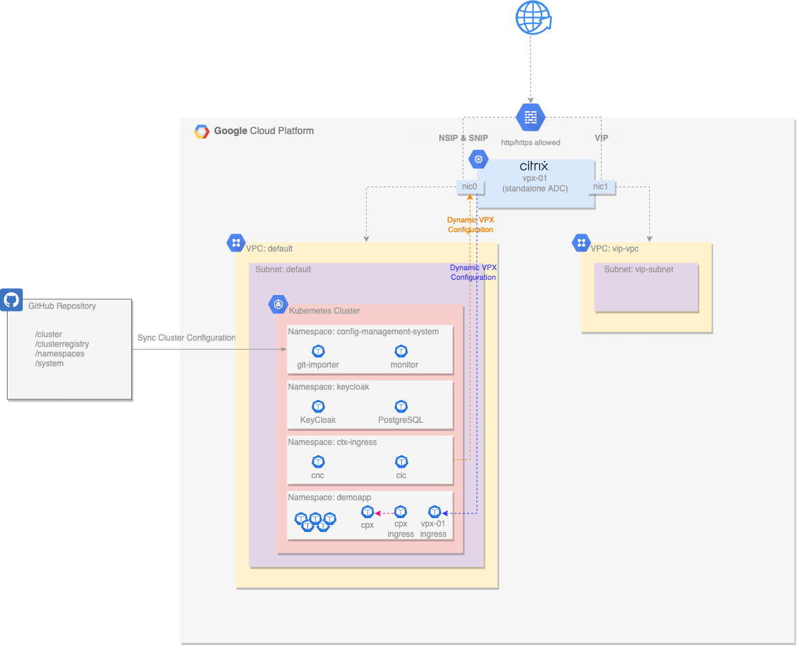
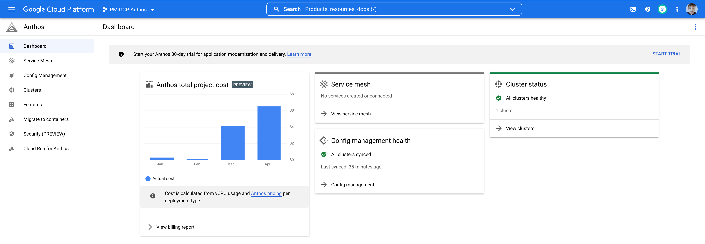

## Citrix ADC with Google Anthos: Dual-tier API Gateway with ACM Lab
This use case focuses on deploying a Tier-1 Citrix ADC (VPX) in front of a Google Anthos GKE cluster within GCP. It leverages Google Anthos Configuration Management for consistent deployment of Citrix components into the Anthos GKE cluster. We will deploy a Tier-2 Citrix ADC (CPX) using ACM within a Kubernetes namespace that will act as a Tier-2 ingress for the microservices deployed in that namespace and make use of ACM for consistent Tier-2 API Gateway policy configurations. Additionally, we will deploy Keycloak, one of the most popular opensource Identity and Access Management solutions, in a dedicated Kubernetes namespace and use it as our Identity Provider and Authorization (OAuth 2.0) server. 

VPX will act as a Tier-1 Enterprise API Gateway where WAF policies will be enabled.

CPX will act as a Tier-2 Ingress API Gateway for a specific namespace where Authentication, Authorization, Rate limiting, Rewrite and Responder policies will be applied for a specific set of APIs.

ACM (Anthos Configuration Management) is a GitOps centric tool that synchronizes configuration into a Anthos Kubernetes cluster from a Git repository. This lab automation has been written with [GitHub](https://github.com) as the git repository tool of choice. 

[Keycloak](https://www.keycloak.org) is one of the most popular opensource Identity and Access Management solutions. It will be used as an Identity Provider and Authorization server (OAuth 2.0) for our Tier-2 CPX API Gateway.

**Note** 
The infrastructure code contained herein is intended to function in a way that suits demonstrations or proof of concepts, but is not hardened or designed for production deployment scenarios. 

**Important**
Please note that ADC VPX security features require ADC to be licensed. After ADC VPX is in place, please make sure to follow the steps required to apply your license in one of the various ways that are supported. For simplicity, for this demonstration we are [Using a standalone Citrix ADC VPX license](lab-automation/Licensing.md). For production deployment scenarios you are encouraged to apply different licensing schemes.
- [Licensing overview](https://docs.citrix.com/en-us/citrix-adc/current-release/licensing.html)
- [Citrix ADC pooled capacity](https://docs.citrix.com/en-us/citrix-application-delivery-management-software/current-release/license-server/adc-pooled-capacity.html)

## Architecture
The following diagram illustrates the infrastructure that is deployed for this use case.  

  
**Citrix Netscaler VPX**  
A single Citrix Netscaler VPX instance is deployed with 2 network interfaces:  
- nic0 provides access for management (NSIP), and access to back end servers (SNIP)
- nic1 provides access for deployed applications (VIPs)
- each interface is assigned an internal private IP address and an external Public IP address
- the instance is deployed as a preemptible node to reduce lab costs
- the instance automatically configures the password with Terraform
- the instance is then automatically configured by the Citrix Ingress Controller and Citrix Node Controller deployed in the GKE cluster 

**VPCs and Firewall Rules**  
2 VPC's are utilized in this deployment: 
- the default VPC and subnets are used for instance and GKE cluster deployment
- the `vip-vpc` is used only to host VIP addresses which routes the traffic back to the services in the default VPC
- default firewall rules apply to the default VPC
- ports 80/443 are permitted into the `vip-vpc`

**GKE Cluster with Anthos Configuration Management**  
A single GKE cluster is deployed as a zonal cluster: 
- autoscaling is enabled with a minimum of 1 node and configurable maximum
- Google Anthos Config Management (ACM) operator is deployed into the GKE cluster and configured to sync the cluster configuration from a GitHub repository
- Citrix Ingress Controller and Citrix Node Controller components are automatically installed via ACM into the `ctx-ingress` namespace
- Citrix [Auth](https://docs.citrix.com/en-us/citrix-k8s-ingress-controller/crds/auth.html), [Rate limit](https://docs.citrix.com/en-us/citrix-k8s-ingress-controller/crds/rate-limit.html), [Rewrite and Responder](https://docs.citrix.com/en-us/citrix-k8s-ingress-controller/crds/rewrite-responder.html), [WAF](https://docs.citrix.com/en-us/citrix-k8s-ingress-controller/crds/waf.html) and [Bot](https://docs.citrix.com/en-us/citrix-k8s-ingress-controller/crds/bot.html) CRDs are installed via ACM to enable developers to create policy configurations
- Keycloak with Postgresql database is installed via ACM into the keycloak namespace
- worker nodes are deployed as preemptible nodes to reduce lab costs

**GitHub Repository**  
A dedicated GitHub repository is created and loaded with a basic cluster configuration: 
- A basic [hierarchical format](https://cloud.google.com/anthos-config-management/docs/concepts/hierarchical-repo) is used for ease of navigation through namespaces and manifests
- Citrix Ingress Controller and Citrix Node Controller deployment manifests are built from templates and added to this repository, along with their required roles/rolebindings/services/etc 
- This repository is created and destroyed by Terraform

**Echoserver Demo Application**  
An [echoserver](https://github.com/GoogleCloudPlatform/microservices-demo) is a server that replicates the request sent by the client and sends it back. It will be used from our lab to showcase: 
- How a request is blocked on Tier-1 VPX based on WAF policies
- How a request is blocked on Tier-2 CPX based on Authentication / Authorization Policies
- How a request is blocked on Tier-2 CPX based on Rate limiting policies when a threshold is reached
- How a request is manipulated (by adding some extra headers) on Tier-2 CPX based on Rewrite policies
- How a response is manipulated on Tier-2 CPX based on Responder policies
- For our lab we will deploy a simple echoserver instance to see the requests reaching our application and the relevant response
- To keep it simple, three (3) Kubernetes services will be created (Pet, User, Play) that will use different ports to access the same microservice (echoserver). That will provide us with an easy way of creating different content routes for each one of the Kubernetes services and showcase how we can apply policies to each API endpoint
- application components and API Gateway configurations are controlled through Anthos Config Management and the source Git Repo

**The following diagram illustrates a high-level architecture, aiming to present the role of each component for our Lab.**


## Lab Deployment
Please refer to [lab-automation/README.md](lab-automation/README.md) for deployment details. 

## Environment Usage  
When the environment has been deployed, terraform will output two public IP addresses, one for management and one for data services. Log into the NetScaler VPX Management interface and review the configuration: 
- Navigate to **System->Network->IPs** to review the IP addresses that have been dynamically configured on the system  
  

- Navigate to **System->Network->VXLANS** to review the VXLAN IDs that have been dynamically configured on the system - this configuration enables the VPX to tunnel into the cluster and access the POD IP space  
  

With the environment fully deployed, navigate to [What's Next Section](lab-automation/README.md#whats-next) to explore our use case for different personas. During trying these use case re-visit the following to see the actual configurations taking place:

- Visit **Traffic Management->Load Balancing->Virtual Servers** to explore the dynamically created virtual services that reside in the Google Anthos GKE cluster  
  

- **Make use of CLI** to explore the same on CPX. First connect to your CPX container and then execute the following command:
    ```shell
    sh-5.1$ kubectl exec -it cpx-ingress-65fb478bb5-thxth -n demoapp bash
    root@cpx-ingress-65fb478bb5-thxth:/# cli_script.sh "sh lb vserver" | grep k8s
    4)	k8s-pet-service_7030_lbv_cfzb2mubztudgxlsbsvhnoqrfl3vccul (0.0.0.0:0) - HTTP	Type: ADDRESS
    5)	k8s-user-service_7040_lbv_cfzb2mubztudgxlsbsvhnoqrfl3vccul (0.0.0.0:0) - HTTP	Type: ADDRESS
    6)	k8s-play-service_7050_lbv_cfzb2mubztudgxlsbsvhnoqrfl3vccul (0.0.0.0:0) - HTTP	Type: ADDRESS
    ```

You can also review the Google Anthos components in the Google Cloud Console:  
- Navigate to the **Anthos** section of the Google Cloud Console to see the newly created cluster  
  

- Select **Clusters** to see more detail about the Anthos GKE cluster that Terraform has created  
  

- Select **Config management** to see more detail about the ACM deployment on the Anthos GKE cluster  
  
