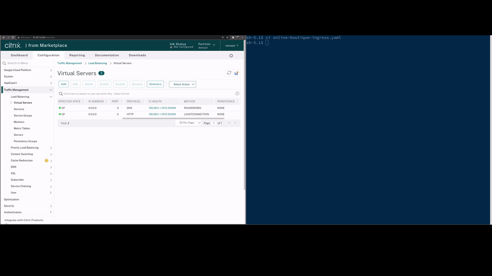
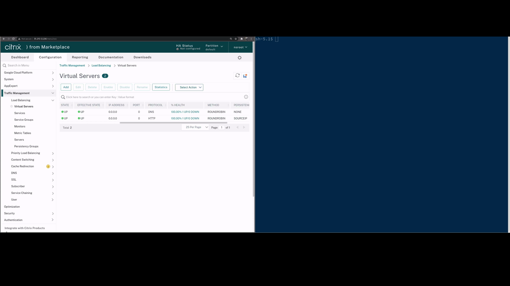

# Developer Persona

## The Setup  


The diagram above illustrates the environment at a high-level. There is an Anthos GKE cluster in which I will deploy my application, with an external Citrix VPX to control ingress traffic into the cluster. This Citrix VPX appliance is managed by external teams and adheres to corporate application delivery standards.  

As a developer, I am responsible for deploying and scaling applications to a Google Anthos platform and ensuring that my application is available and complies to my corporate deployment standards. Network ingress into my application needs to scale with the application, regardless of where the application is running.  

## The Why  

Deploying applications into a Citrix Integrated Google Anthos Platform allows me, the developer, to set specific network configurations as simple annotations within my kubernetes manifests. I don't need to learn an additional platform or tool, and this configuration will be applied in accordance with any constraints set out by the platform, network, and security teams. This allows my application to get to market faster with less internal meetings, approvals, or change requests.  


## The How  

---
**NOTE**
In this demonstration, the kubectl binary and local files are used to deploy the application. In production scenarios, other deployment methods would likely be in place, such as a GitOps approach as provided from Google Anthos Configuration Management.  

---

First I will deploy the online boutique sample application with a simple ingress object. Following the deployment, I will modify the ingress object to perform tasks such as forcing users to only leverage SSL. Finally will will change the load balancing type and the persistence type. These steps help to outline the control I have over the load balancing of traffic into my application, without the need to engage with the network team to make Application Delivery Controller configuration changes. 

- Deploy the application and a simple ingress object ... first clone the git repository that the automation created, then deploy the application **Note that you will need to replace the <github-org> and <repo> tags according to your deployment of this lab** 
  ```shell
  sh-5.1$ git clone git@github.com:<github-org>/<repo>.git
  Cloning into '<repo>'...
  remote: Enumerating objects: 301, done.
  remote: Counting objects: 100% (301/301), done.
  remote: Compressing objects: 100% (283/283), done.
  remote: Total 301 (delta 102), reused 0 (delta 0), pack-reused 0
  Receiving objects: 100% (301/301), 33.28 KiB | 2.38 MiB/s, done.
  Resolving deltas: 100% (102/102), done.
  sh-5.1$ cd <repo>/online-boutique/
  sh-5.1$ kubectl create namespace demoapp
  sh-5.1$ kubectl apply -f online-boutique.yaml -n demoapp
  sh-5.1$ kubectl get pods -n demoapp 
  NAME                                     READY   STATUS    RESTARTS   AGE
  adservice-5844cffbd4-c8b66               1/1     Running   0          52s
  cartservice-fdc659ddc-bgzzv              1/1     Running   0          54s
  checkoutservice-64db75877d-8qfp5         1/1     Running   0          56s
  currencyservice-9b7cdb45b-xhs5q          1/1     Running   0          53s
  emailservice-64d98b6f9d-xxr4v            1/1     Running   0          56s
  frontend-76ff9556-kzjkh                  1/1     Running   0          55s
  paymentservice-65bdf6757d-m6jn4          1/1     Running   0          54s
  productcatalogservice-5cd47f8cc8-2v9bh   1/1     Running   0          54s
  recommendationservice-b75687c5b-z7lk7    1/1     Running   0          55s
  redis-cart-74594bd569-hkk8x              1/1     Running   0          52s
  shippingservice-778554994-fsnsp          1/1     Running   0          53s
  sh-5.1$ cat ingress.yaml 
  # #Specify the ingress resource
  apiVersion: networking.k8s.io/v1
  kind: Ingress
  metadata:
    name: online-boutique-ingress
    annotations:
    kubernetes.io/ingress.class: "tier-1-vpx"
    ingress.citrix.com/insecure-termination: "allow"
  spec:
    rules:
    - host: <ip-address>.nip.io
      http:
        paths:
        - path: /
          pathType: Prefix
          backend:
            service:
              name: frontend
              port: 
                number: 80
  sh-5.1$ kubectl apply -f ingress.yaml -n demoapp
  ingress.networking.k8s.io/online-boutique-ingress created
  ```

  

- Reconfigure the ingress object to only allow for SSL traffic using the default certificate (configured by the platform team) and ssl redirect
  ```shell
    sh-5.1$ cat ingress.yaml 
    # #Specify the ingress resource
    apiVersion: networking.k8s.io/v1
    kind: Ingress
    metadata:
      name: online-boutique-ingress
      annotations:
      kubernetes.io/ingress.class: "tier-1-vpx"
      ingress.citrix.com/insecure-termination: "redirect"
      ingress.citrix.com/secure-port: "443"
    spec:
      tls:
      - secretName:
      rules:
      - host: <ip-address>.nip.io
        http:
          paths:
          - path: /
            pathType: Prefix
            backend:
              service:
                name: frontend
                port: 
                  number: 80
    sh-5.1$ kubectl apply -f ingress.yaml -n demoapp
    ingress.networking.k8s.io/online-boutique-ingress configured
  ```
    

  - Reconfigure the Ingress object to change the load balancing type and persistence type
  ```shell
  sh-5.1$ cat ingress.yaml 
  # #Specify the ingress resource
  apiVersion: networking.k8s.io/v1
  kind: Ingress
  metadata:
    name: online-boutique-ingress
    annotations:
    kubernetes.io/ingress.class: "tier-1-vpx"
    ingress.citrix.com/insecure-termination: "redirect"
    ingress.citrix.com/secure-port: "443"
    ingress.citrix.com/lbvserver: '{"frontend":{"lbmethod":"ROUNDROBIN", "persistenceType":"SOURCEIP"}}'
  spec:
    tls:
    - secretName:
    rules:
    - host: <ip-address>.nip.io
      http:
        paths:
        - path: /
          pathType: Prefix
          backend:
            service:
              name: frontend
              port: 
                number: 80
    sh-5.1$ kubectl apply -f ingress.yaml -n demoapp
    ingress.networking.k8s.io/online-boutique-ingress configured
  ```
    

Next, to demonstrate the added visibility that the network team has into my deployment, I will scale up my application. 
  ```shell
  sh-5.1$ kubectl scale deployment frontend --replicas=3 -n demoapp
  deployment.apps/frontend scaled
  sh-5.1$ kubectl get pods -l app=frontend
  NAME                      READY   STATUS    RESTARTS   AGE
  frontend-76ff9556-9rvjq   1/1     Running   0          36s
  frontend-76ff9556-gdm48   1/1     Running   0          36s
  frontend-76ff9556-kzjkh   1/1     Running   0          17m
  ```
  


To see more configuration options, review the [supported annotations](https://github.com/citrix/citrix-k8s-ingress-controller/blob/master/docs/configure/annotations.md) documentation. 


## Summary  

As a developer, my primary concern is to quickly and securely release my cloud-native application with the pace of my development team and without delays from external teams. Using the Citrix Ingress Controller in a Google Anthos platform allows my team to achieve this goal. 
- Network, Security, and Platform teams can configure sensible defaults automatically without needing my involvement
- Configurable items specific to my application are delegated to my team in a self-service manner
- Visibility of my workloads are present in the northbound network infrastructure to provide better monitoring and alerting across teams
- I can collaborate in network troubleshooting with my network engineers with a shared context and understanding of my workloads
