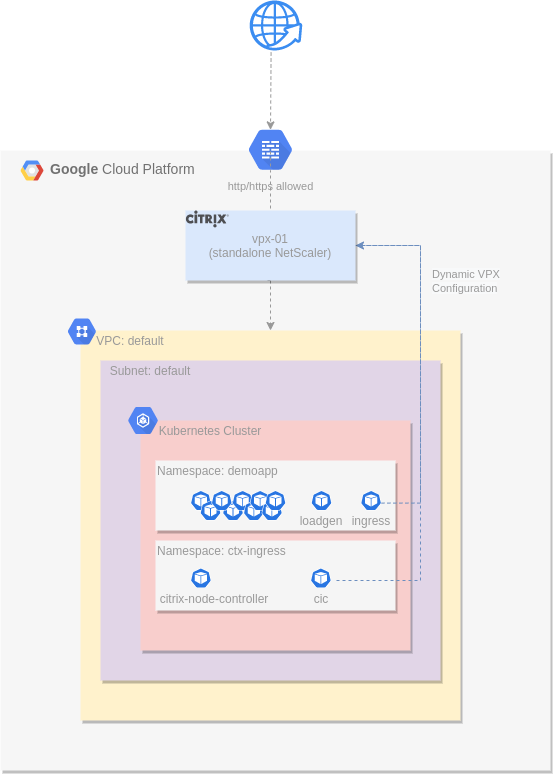

# Security Persona

## The Setup  

The diagram above illustrates the environment at a high-level. There is an Anthos GKE cluster in which the application is deployed via Anthos Config Management (ACM), with an external Citrix VPX to control ingress traffic into the cluster.   
As a security engineer, I am responsible for working with network and platform teams to ensure all network components adhere to corporate security standards, responding to security events, and reducing the security configuration requirements for application teams. My goal is to provide application teams with the ability to automatically inherit secure network configuraitons. 

## The Why  

Applications deployed into a Citrix Integrated Google Anthos Platform allows developers to manage certain aspects of their application's network configuration requirements via annotations within Kubernetes manifests. The Citrix controller deployed within the GKE cluster configures the upstream VPX that is managed by the network team, as the underlying application infrastructure within Kubernetes changes. While the VPX and network infrastructure configuration remains in the domain of the network team, and the application configurations remain in the domain of the developer and application teams, my role is to ensure that security related configurations align with corporate standards and are being enforced. 

## The How  

During an application scale up event, the Security persona has no active role. Instead, the Security persona would be involved in the following ways: 
- Ensuring that platform components are configured according to corporate security standards
  - During platform deployment
  - Actively during platform runtime

In order to audit the active configuration of the Citrix Ingress Controller and Node Controller, the Security engineer can review the Git repository that maintains this configuration. With Google Anthos GKE, ACM sychronizes the configuration found in Git to the running cluster, resulting in the Git repository accurately reflecting the running configuration. This makes it easier for Security engineers to review platform configuraitons without the need for privileged access directly to the platform. 

In this demonstration environment, a dedicated GitHub repo is created for ACM, and the following content is automatically placed into that repository within an `acm` folder. A dedicated namespace called `ctx-ingress` is created to hold the core Citrix deployments, while other system level manifests are located in the `cluster` directory of the ACM repository. 
- Deployments
  - https://github.com/<github_owner>/<github_reponame>/acm/namespaces/ctx-ingress/cic-deployment.yaml
  - https://github.com/<github_owner>/<github_reponame>/acm/namespaces/ctx-ingress/cnc-deployment.yaml
- Config Maps
  - https://github.com/<github_owner>/<github_reponame>/acm/namespaces/ctx-ingress/cnc-configmap.yaml
- Service Accounts
  - https://github.com/<github_owner>/<github_reponame>/acm/namespaces/ctx-ingress/cnc-service-account.yaml
  - https://github.com/<github_owner>/<github_reponame>/acm/namespaces/ctx-ingress/cpx-ingress-serviceaccount.yaml
- Roles
  - https://github.com/<github_owner>/<github_reponame>/acm/cluster/cnc-clusterrole.yaml
  - https://github.com/<github_owner>/<github_reponame>/acm/cluster/cpx-clusterrole.yaml
- Rolebindings
  - https://github.com/<github_owner>/<github_reponame>/acm/cluster/cnc-clusterrolebinding.yaml
  - https://github.com/<github_owner>/<github_reponame>/acm/cluster/cpx-clusterrolebinding.yaml

Review the above manifests to ensure they adhere to corporate security standards. 

## Summary  

As a Security engineer, my primary focus is ensure that applicaions deployed on the platform adhere with corporate security standards. While I do not hold an active role in an application scaleup event, I can continue to support my team by: 
- Auditing the ACM repository to ensure configurations adhere to corporate security standards
- Making configuration recommendations to enhance the security of deployed applications
- Working collaboratively with Network, Platform, and Development teams through a GitOps model
