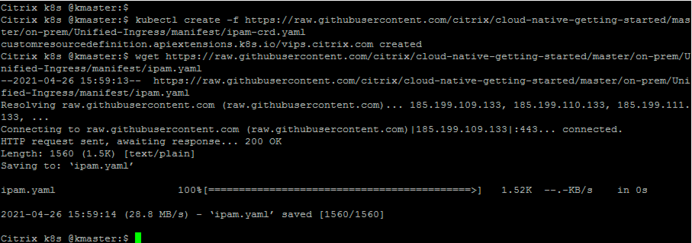
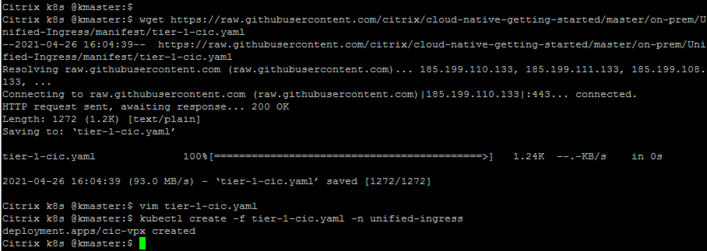
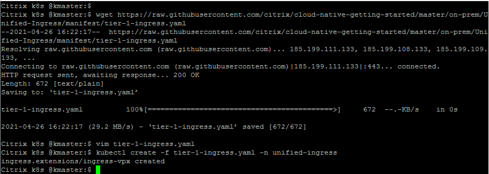
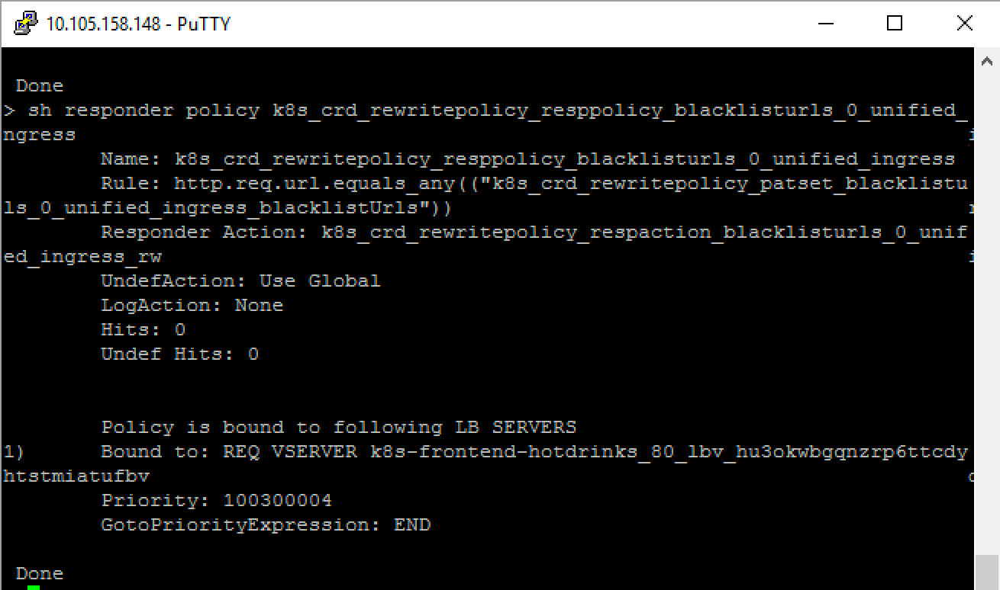
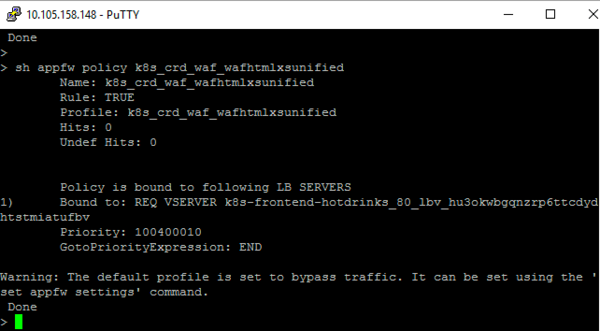
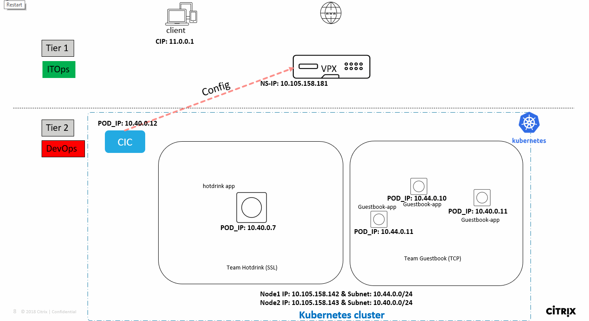

# Deploy Citrix Cloud native solution for Unified Ingress Topology in on-prem Kubernetes cluster (Tier 1 ADC as Citrix ADC VPX, Tier 2 as microservice applications)

In this guide you will learn:
* How to deploy a microservice application exposed as Ingress type service.
* How to deploy a microservice application exposed as Load Balancer type service.
* How to deploy a microservice application exposed as NodePort type service.
* How to configure Citrix ADC VPX (Tier 1 ADC) using Citrix Ingress Controller to load balance all above three services.
* How to configure Rewrite Responder policy on Tier 1 ADC - VPX using CRDs
* How to configure WAF on Tier 1 ADC - VPX using WAF CRDs.

Citrix ADC supports Unified Ingress architecture to load balance an enterprise grade applications deployed as microservices. Citrix load balancers can be VPX/SDX/MPX/BLX, or CPX (containerized Citrix ADC) to manage high scale north-south traffic. Lets understand the Unified Ingress topology using below diagram.


###### Step by step guide to deploy microservices in Unified Ingress topology

1.	Bring your own nodes (BYON)

    Kubernetes is an open-source system for automating deployment, scaling, and management of containerized applications. Please install and configure Kubernetes cluster with one master node and at least two worker node deployment.
    Visit: https://kubernetes.io/docs/setup/ for Kubernetes cluster deployment guide.

    **Prerequisite**: This example is validated on K8s cluster v1.22.2

    Once Kubernetes cluster is up and running, execute the below command on master node to get the node status.
    ``` 
    kubectl get nodes
    ```
    

2.	[Optional] Set up a Kubernetes dashboard for deploying containerized applications
    Please visit https://kubernetes.io/docs/tasks/access-application-cluster/web-ui-dashboard/ and follow the steps mentioned to bring the Kubernetes dashboard up as shown below.

    

3. Add K8s CIDR routes to Tier 1 ADC to reach K8s network

    Make sure that route configuration is present in Tier 1 ADC so that Ingress NetScaler should be able to reach Kubernetes pod network for seamless connectivity. Please refer to https://github.com/citrix/citrix-k8s-ingress-controller/blob/master/docs/network/staticrouting.md#manually-configure-route-on-the-citrix-adc-instance for Network configuration.
    If you have K8s cluster and Tier 1 Citrix ADC in same subnet then you do not have to do anything, below example will take care of route info.
    You need Citrix Node Controller configuration only when K8s cluster and Tier 1 ADC are in different subnet. Please refer to https://github.com/citrix/citrix-k8s-node-controller for Network configuration.


| Section | Description |
| ------- | ----------- |
| [Section A](https://github.com/citrix/cloud-native-getting-started/tree/master/on-prem/Unified-Ingress#section-a-deploy-colddrink-beverage-microservice-application-exposed-as-load-balancer-type-service) | Deploy colddrink beverage microservice application exposed as Load Balancer Type service |
| [Section B](https://github.com/citrix/cloud-native-getting-started/tree/master/on-prem/Unified-Ingress#section-b-deploy-hotdrink-beverage-microservice-application-exposed-as-ingress-type-service) | Deploy hotdrink beverage microservice application exposed as Ingress Type service |
| [Section C](https://github.com/citrix/cloud-native-getting-started/tree/master/on-prem/Unified-Ingress#section-c-deploy-guestbook-microservice-application-exposed-as-nodeport-type-service) | Deploy Guestbook microservice application exposed as NodePort Type service |
| [Section D](https://github.com/citrix/cloud-native-getting-started/tree/master/on-prem/Unified-Ingress#section-d-configure-responder-policy-l7-policy-on-vpx-using-rewrite-responder-crds) | Configure Responder policy (L7 policy) on VPX using rewrite-responder CRDs |
| [Section E](https://github.com/citrix/cloud-native-getting-started/tree/master/on-prem/Unified-Ingress#section-e-configure-waf-policies-on-vpx-using-waf-crds) | Configure WAF policies on VPX using WAF CRDs |
| [Section F](https://github.com/citrix/cloud-native-getting-started/tree/master/on-prem/Unified-Ingress#section-f-clean-up-unified-ingress-deployment) | Clean Up |

### Section A (Deploy colddrink beverage microservice application exposed as Load Balancer type service)

1.	Lets create a K8s namespace ``unified-ingress`` and define role based access using RBAC yaml
    ```
    kubectl create -f https://raw.githubusercontent.com/citrix/cloud-native-getting-started/master/on-prem/Unified-Ingress/manifest/rbac.yaml 
    ```
    

2.  Deploy the colddrink beverage microservice application (LoadBalancer type service)
    ```
    kubectl create -f https://raw.githubusercontent.com/citrix/cloud-native-getting-started/master/on-prem/Unified-Ingress/manifest/colddrink.yaml -n unified-ingress
    ```
    

    **Note:** Please upload your TLS certificate and TLS key into hotdrink-secret.yaml. We have updated our security policies and removed SSL certificate from guides. (Hotdrink secret is common for hotdrink and colddrink app, you can opt to use different secret).
    ```
    wget https://raw.githubusercontent.com/citrix/cloud-native-getting-started/master/on-prem/Unified-Ingress/manifest/hotdrink-secret.yaml
    ```
    Update tls.crt and tls.key values and deploy hotdrink-secret.yaml
    ```
    kubectl create -f hotdrink-secret.yaml -n unified-ingress
    ```

3. Deploy IPAM CRD and IPAM to allocate IP address to access colddrink beverage microservice
    ```
    kubectl create -f https://raw.githubusercontent.com/citrix/cloud-native-getting-started/master/on-prem/config/crds/ipam-crd.yaml
    wget https://raw.githubusercontent.com/citrix/cloud-native-getting-started/master/on-prem/Unified-Ingress/manifest/ipam.yaml
    ```
    Change the IP range to your free VIP IP range for allocating IP from pool to access colddrink microservice
    
    e.g.        name: "VIP_RANGE"
                value: '["10.221.36.189", "10.221.36.189-192", "10.221.36.180/32"]'

    ```
    kubectl create -f ipam.yaml
    ```
     

4. Deploy Citrix Ingress Controller to configure Tier 1 ADC

    To configure Tier 1 ADC (I have used VPX as my Tier 1 ADC, you can refer to https://github.com/citrix/cloud-native-getting-started/tree/master/VPX for setting up VPX in XenServer)
    ```
    wget https://raw.githubusercontent.com/citrix/cloud-native-getting-started/master/on-prem/Unified-Ingress/manifest/tier-1-cic.yaml
    ```
    Change "NS_IP" = <Tier 1 ADC NSIP> used in your deployment. Comment out "NS_PROTOCOL", "NS_PORT" fields in case TLS is not enabled for VPX login.
    
    Add kubernetes secret as VPX login credentials. Change username and password field in below command.
    ```
    kubectl create secret generic nsvpxlogin --from-literal=username='username' --from-literal=password='password' -n unified-ingress
    ```

    Now, deploy Citrix Ingress Controller!

    ```
    kubectl create -f tier-1-cic.yaml -n unified-ingress
    ```
    

5. Access colddrink beverage microservice
    ```
    kubectl get svc -n unified-ingress -o wide
    ```
    
    
    You can even access colddrink application from local browser using URL - ``http://< External-IP for colddrink app >`` (e.g. http://10.105.158.196)

### Section B (Deploy hotdrink beverage microservice application exposed as Ingress Type service)

**Prerequisite/ Note:** In case you have directly started from Section B and have not followed the Section A, then you need to deploy Citrix Ingress Controller and RBAC from Section A to make Section B work independently.``Deploy Step 1 and Step 4 from Section A.``

1.	Deploy hotdrink beverage microservice application (Ingress type service)
    
    **Note:** Please upload your TLS certificate and TLS key into hotdrink-secret.yaml. We have updated our security policies and removed SSL certificate from guides.
    
    ```
    kubectl create -f https://raw.githubusercontent.com/citrix/cloud-native-getting-started/master/on-prem/Unified-Ingress/manifest/hotdrink.yaml -n unified-ingress
    kubectl create -f https://raw.githubusercontent.com/citrix/cloud-native-getting-started/master/on-prem/Unified-Ingress/manifest/hotdrink-secret.yaml -n unified-ingress
    ```
    
    
2.  Deploy Ingress rule to send traffic to hotdrink beverages microservices

    **Note:** In case you have directly started from Section B and have not followed the Section A, then you need to deploy Citrix Ingress Controller and RBAC from Section A to make Section B work independently.
    ``Deploy Step 1 and Step 4 from Section A.``

    ```
    wget https://raw.githubusercontent.com/citrix/cloud-native-getting-started/master/on-prem/Unified-Ingress/manifest/tier-1-ingress.yaml
    ```
    Change "ingress.citrix.com/frontend-ip:" to free IP that you want to use as Ingress IP.
    ```
    kubectl create -f tier-1-ingress.yaml -n unified-ingress
    ```
    
    
    Note: tier-1-ingress.yaml also contains the ingress rule for guestbook microservice deployment (Section C)

    
3.	Add the DNS entries in your local machine host files for accessing microservices though Internet
    Path for host file:[Windows] ``C:\Windows\System32\drivers\etc\hosts`` [Macbook] ``/etc/hosts``
    Add below entries in hosts file and save the file

    ```
    <frontend-ip from ingress_vpx.yaml> hotdrink.beverages.com
    ```
  
4.	Lets access hotdrink beverage microservice app from local machine browser
    e.g. ``https://hotdrink.beverages.com``


### Section C (Deploy Guestbook microservice application exposed as NodePort Type service)

    **Note:** In case you have directly started from Section C and have not followed the Section A/B, then you need to deploy Citrix Ingress Controller and RBAC from Section A (Step 1 and Step 4) and Ingress rule from Section B (Step 2) to make Section C work independently.

    
1.  Deploy the guestbook microservice application (NodePort type service)
    ```
    kubectl create -f https://raw.githubusercontent.com/citrix/cloud-native-getting-started/master/on-prem/Unified-Ingress/manifest/guestbook.yaml -n unified-ingress
    ```
     

    **Note:** In case you have directly started from Section C and have not followed the Section A/B, then you need to deploy Citrix Ingress Controller and RBAC from Section A (Step 1 and Step 4) and Ingress rule from Section B (Step 2) to make Section C work independently.
    
 
2.	Add the DNS entries in your local machine host files for accessing microservices though Internet
    Path for host file:[Windows] ``C:\Windows\System32\drivers\etc\hosts`` [Macbook] ``/etc/hosts``
    Add below entries in hosts file and save the file

    ```
    <frontend-ip from ingress_vpx.yaml> guestbook.beverages.com
    ```
  
3.	Lets access hotdrink beverage microservice app from local machine browser
    e.g. ``https://guestbook.beverages.com``


### Section D (Configure Responder policy (L7 policy) on VPX using rewrite-responder CRDs)

We will configure Responder policy on VPX for hotdrink beverage application deployment. In case you have not deployed hotdrink app, follow [Section B](https://github.com/citrix/cloud-native-getting-started/tree/master/on-prem/Unified-Ingress#section-a-deploy-hotdrink-beverage-microservice-application-exposed-as-ingress-type-service) and continue here.

1. Deploy the CRD for Rewrite and Responder policies in default namespace
    ```
    kubectl create -f https://raw.githubusercontent.com/citrix/cloud-native-getting-started/master/on-prem/config/crds/rewrite-responder-crd.yaml
    ```
2. **Blacklist URLs** Configure the Responder policy on `hotdrink.beverages.com` to block access to the hotdrink beverage microservice
    ```
    kubectl create -f https://raw.githubusercontent.com/citrix/cloud-native-getting-started/master/on-prem/Unified-Ingress/manifest/responder-hotdrink.yaml
    ```
     

     Now, lets check the VPX and find responder policy is present on LB vserver corresponds to hotdrink app.

    

    Now try to access `https://hotdrink.beverages.com ` and you will see that responder policy has blocked the access to hotdrink beverage microservice application.


### Section E (Configure WAF policies on VPX using WAF CRDs)

Here we will configure Web Application Firewall policies on VPX for hotdrink beevrage application and colddrink beverage applications using WAF CRD. Know more about WAF CRD from [developer-docs](https://developer-docs.citrix.com/projects/citrix-k8s-ingress-controller/en/latest/crds/waf/)

**Note:** Ensure you have licensed VPX to configure WAF features.

1. Deploy WAF CRD

    ```
    kubectl create -f https://raw.githubusercontent.com/citrix/cloud-native-getting-started/master/on-prem/config/crds/waf-crd.yaml
    ```

2. Enable cross-site scripting and SQL injection attacks protection for hotdrink beverage application

    **Note:** In case you have not deployed hotdrink app, follow [Section B](https://github.com/citrix/cloud-native-getting-started/tree/master/on-prem/Unified-Ingress#section-b-deploy-hotdrink-beverage-microservice-application-exposed-as-ingress-type-service) and continue here. 

    ```
    kubectl create -f https://raw.githubusercontent.com/citrix/cloud-native-getting-started/master/on-prem/Unified-Ingress/manifest/hotdrink-waf-policy.yaml -n unified-ingress
    ```

    

    Now, lets check the VPX and find WAF policy is present on LB vserver corresponds to hotdrink app.

    

3. Configure URL filtering rules for colddrink beverage application to prevent repeated attempts to access random URLs on a web site

    **Note:** In case you have not deployed colddrink app, follow [Section A](https://github.com/citrix/cloud-native-getting-started/tree/master/on-prem/Unified-Ingress#section-a-deploy-colddrink-beverage-microservice-application-exposed-as-load-balancer-type-service) and continue here. 

    ```
    kubectl create -f https://raw.githubusercontent.com/citrix/cloud-native-getting-started/master/on-prem/Unified-Ingress/manifest/colddrink-waf-policy.yaml -n unified-ingress
    ```

    

    Now, lets check the VPX and find WAF policy is present on LB vserver corresponds to colddrink app.

    
       

### Section F (Clean UP Unified Ingress deployment)
    ```
    kubectl delete -f https://raw.githubusercontent.com/citrix/cloud-native-getting-started/master/on-prem/Unified-Ingress/manifest/colddrink.yaml -n unified-ingress
    kubectl delete -f https://raw.githubusercontent.com/citrix/cloud-native-getting-started/master/on-prem/Unified-Ingress/manifest/ipam-crd.yaml
    kubectl delete -f ipam.yaml
    kubectl delete -f https://raw.githubusercontent.com/citrix/cloud-native-getting-started/master/on-prem/Unified-Ingress/manifest/rbac.yaml 
    kubectl delete -f https://raw.githubusercontent.com/citrix/cloud-native-getting-started/master/on-prem/Unified-Ingress/manifest/hotdrink.yaml -n unified-ingress
    kubectl delete -f https://raw.githubusercontent.com/citrix/cloud-native-getting-started/master/on-prem/Unified-Ingress/manifest/hotdrink-secret.yaml -n unified-ingress
    kubectl delete -f tier-1-ingress.yaml -n unified-ingress
    kubectl delete -f tier-1-cic.yaml -n unified-ingress
    kubectl delete -f https://raw.githubusercontent.com/citrix/cloud-native-getting-started/master/on-prem/Unified-Ingress/manifest/guestbook.yaml -n unified-ingress
    kubectl delete -f https://raw.githubusercontent.com/citrix/cloud-native-getting-started/master/on-prem/config/crds/rewrite-responder-crd.yaml
    kubectl delete -f https://raw.githubusercontent.com/citrix/cloud-native-getting-started/master/on-prem/config/crds/waf-crd.yaml
    kubectl delete -f https://raw.githubusercontent.com/citrix/cloud-native-getting-started/master/on-prem/config/crds/ipam-crd.yaml
    kubectl delete namespace unified-ingress
    ```


### Packet Flow Diagrams
--------------------

Citrix ADC solution supports the load balancing of various protocol layer traffic such as SSL,  SSL_TCP, HTTP, TCP. Below screen-shot has listed different flavours of traffic supported by this demo.


#### How does ingress traffic reache hotdrink-beverage microservices?

Client sends the traffic to Tier 1 ADC through Content Switching virtual server and reaches to pods where hotdrink beverage microservices are running. Detailed traffic flow is allocated in following gif picture (please wait for a moment on gif picture to see the packet flow).

 
#### How does ingress traffic reach guestbook-beverage microservices?
Client sends the traffic to Tier 1 ADC through Content Switching virtual server and reaches to pods where guestbook beverage microservices are running. Detailed traffic flow is allocated in following gif picture (please wait for a moment on gif picture to see the packet flow).


Please refer to Citrix ingress controller for more information, present at- https://github.com/citrix/citrix-k8s-ingress-controller

For next tutorial, visit [cloud-native-getting-started](https://github.com/citrix/cloud-native-getting-started)
