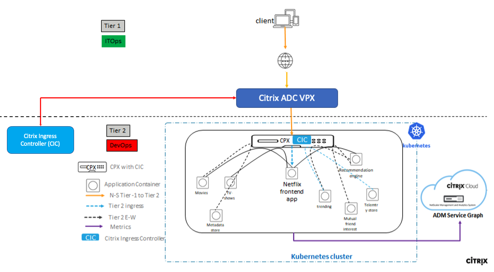
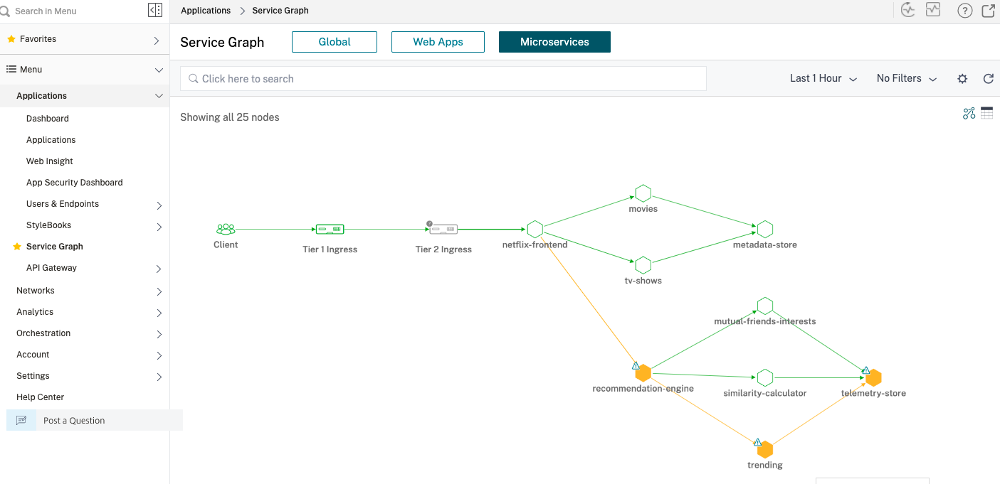

# Citrix ADM Service Graph Distributed Tracing
The aim of this example is to help visualising the request flow between different microservices using Citrix ADM
# Table of Contents

A. [Deploy and register Citrix ADM Agent](#deploy-register-citrix-adm-agent)

B. [Add Cluster in Citrix ADM](#register-adm-agent)

C. [Configuration for service graph in ADM](#config-adm) 

D. [Deploy Netflix application on Kubernetes Cluster ](#deploy-application)

E. [Citrix Cloud Native Dual Tier Topology ](#deploy-citrix-cloud-native-stack)

F. [Send Traffic](#send-traffic) 

G. [Visualize Servicegraph in Citrix ADM](#servicegraph)

H. [Tracing](#trace)

# Prerequisites.
-  Citrix ADM Cloud Service Account

- The [Kubernetes](https://kubernetes.io/) version 1.6 or later

  The user name and password of the Citrix ADC VPX or MPX appliance used as the ingress device for Tier-1. The Citrix ADC appliance needs to have system user account (non-default) with certain privileges so that Citrix ingress controller can configure the Citrix ADC VPX or MPX appliance. For instructions to create the system user account on Citrix ADC, see [Create System User Account for CIC in Citrix ADC](#create-system-user-account-for-cic-in-citrix-adc).
    You can pass user name and password using Kubernetes secrets. Create a Kubernetes secret for the user name and password using the following command:

```
    kubectl create secret generic nslogin --from-literal=username='cic' --from-literal=password='mypassword'
```
- **Route Addition in MPX/VPX**

    For seamless functioning of services deployed in the Kubernetes cluster, it is essential that Ingress Citrix ADC device should be able to reach the underlying overlay network over which Pods are running.
    `feature-node-watch` knob of Citrix Ingress Controller can be used for automatic route configuration on Citrix ADC towards the pod network. Refer [Static Route Configuration](https://github.com/citrix/citrix-k8s-ingress-controller/blob/master/docs/network/staticrouting.md) for further details regarding the same.

    By default, `feature-node-watch` is false. It needs to be explicitly set to true if auto route configuration is required.

    This can also be achieved by deploying [Citrix Node Controller](https://github.com/citrix/citrix-k8s-node-controller).

    Or you can configure static routes manually on Citrix ADC VPX or MPX to reach the pods inside the cluster. Please follow below steps:
    ### For Kubernetes:
    1. Obtain podCIDR using below options:
     ```
       kubectl get nodes -o yaml | grep podCIDR
    ```
    * podCIDR: 10.244.0.0/24
    * podCIDR: 10.244.1.0/24
    * podCIDR: 10.244.2.0/24

    2. Log on to the Citrix ADC instance.

    3. Add Route in Citrix ADC VPX/MPX
   ```
        add route <podCIDR_network> <podCIDR_netmask> <node_HostIP>
   ```
    4. Ensure that Ingress MPX/VPX has a SNIP present in the host-network (i.e. network over which K8S nodes communicate with each other. Usually eth0 IP is from this network).

    Example:
    * Node1 IP = 192.0.2.1
    * podCIDR  = 10.244.1.0/24
    * add route 10.244.1.0 255.255.255.0 192.0.2.1

### <a name="create-system-user-account-for-cic-in-citrix-adc"> Create system User account for Citrix ingress controller in Citrix ADC</a>

Citrix ingress controller configures the Citrix ADC using a system user account of the Citrix ADC. The system user account should have certain privileges so that the CIC has permission configure the following on the Citrix ADC:
-  Add, Delete, or View Content Switching (CS) virtual server
-  Configure CS policies and actions
-  Configure Load Balancing (LB) virtual server
-  Configure Service groups
-  Cofigure SSl certkeys
-  Configure routes
-  Configure user monitors
-  Add system file (for uploading SSL certkeys from Kubernetes)
-  Configure Virtual IP address (VIP)
-  Check the status of the Citrix ADC appliance

**Note:**
> The system user account would have privileges based on the command policy that you define.
To create the system user account, do the following:
1.  Log on to the Citrix ADC appliance. Perform the following:
    1.  Use an SSH client, such as PuTTy, to open an SSH connection to the Citrix ADC appliance.
    2.  Log on to the appliance by using the administrator credentials.
2.  Create the system user account using the following command:
    ```
       add system user <username> <password>
    ```
    For example:
    ```
       add system user cic mypassword
    ```
3.  Create a policy to provide required permissions to the system user account. Use the following command:
    ```
       add cmdpolicy cic-policy ALLOW "(^\S+\s+cs\s+\S+)|(^\S+\s+lb\s+\S+)|(^\S+\s+service\s+\S+)|(^\S+\s+servicegroup\s+\S+)|(^stat\s+system)|(^show\s+ha)|(^\S+\s+ssl\s+certKey)|(^\S+\s+ssl)|(^\S+\s+route)|(^\S+\s+monitor)|(^show\s+ns\s+ip)|(^\S+\s+system\s+file)"
    ```
    Bind the policy to the system user account using the following command:
    ```
       bind system user cic cic-policy 0
    ```    

## <a name="deploy-register-citrix-adm-agent">A) Deploy and register Citrix ADM Agent</a>
Follow [this](https://docs.citrix.com/en-us/citrix-application-delivery-management-service/getting-started.html) link to deploy Citrix ADM agent.

## <a name="register-adm-agent"> B) Add Cluster in Citrix ADM</a>

Refer [this](https://docs.citrix.com/en-us/citrix-application-delivery-management-service/application-analytics-and-management/sg-service-mesh-dual-tier-topology.html#add-kubernetes-cluster-in-citrix-adm) for adding cluster in Citrix ADM  using VM based ADM Agent.

To add cluster using container based Agent, follow the below steps:

B.1 Log on to Citrix ADM with administrator credentials.

B.2 Navigate to `Orchestration > Kubernetes > Cluster`. The Clusters page is displayed.

B.3 Click `Add`.

B.4 In the Add Cluster page, specify the following parameters:

a. **Name** - Specify a name of your choice.

b. **API Server URL** - You can get the Kubernetes service IP in `default` namespace. Provide the IP in format `https://<IP>:443`
      
```
   kubectl get svc kubernetes -o wide -n default
```

c. **Authentication Token** - Specify the authentication token. The authentication token is required to validate access for communication between Kubernetes cluster and Citrix ADM.

To generate an authentication token; On the Kubernetes master node:

i. Use the following YAML to create a service account:

```
apiVersion: v1
kind: ServiceAccount
metadata:
    name: <name>
    namespace: <namespace>
```
    
ii. Run `kubectl create -f <yaml file>`. The service account is created.

iii. Run `kubectl create clusterrolebinding <name> --clusterrole=cluster-admin --serviceaccount=<namespace>:<name>` to bind the cluster role to service account.

The service account now has the cluster-wide access. A token is automatically generated while creating the service account

iv. Run `kubectl describe sa <name>` to view the token.

v. To get the secret string, run kubectl describe secret <token-name>.

d. Select the agent from the list.

e. Click Create.


**NOTE:** 
**To register Citrix ADC CPX in ADM**: To obtain [servicegraph](https://docs.citrix.com/en-us/citrix-application-delivery-management-service/application-analytics-and-management/service-graph.html), you will have to create a Kubernetes secret using ADM Agent credentials. Create a Kubernetes secret for the user name and password using the following command:

  ```
  kubectl create secret generic admlogin --from-literal=username=<adm-username> --from-literal=password=<adm-password> 
  ```

## <a name="config-adm"> C) Configuration for service graph in ADM </a> 

Enable  [Auto-select Virtual Servers](https://docs.citrix.com/en-us/citrix-application-delivery-management-service/application-analytics-and-management/sg-service-mesh-dual-tier-topology.html#enable-auto-select-virtual-servers-for-licensing)  to license the CPX virtual servers.
 
Enable the  [Web transaction and TCP transaction settings](https://docs.citrix.com/en-us/citrix-application-delivery-management-service/application-analytics-and-management/sg-service-mesh-dual-tier-topology.html#enable-web-transaction-and-tcp-transaction-settings)  to  **All**  for Citrix ADM agent to get HTTP and TCP transactions.

## <a name="deploy-application"> D) Deploy Netflix application on Kubernetes Cluster </a> 
Run following to deploy Netflix application on your Kubernetes Cluster 
```
   kubectl create -f https://raw.githubusercontent.com/citrix/cloud-native-getting-started/master/servicegraph/manifest/netflix.yaml
```
## <a name="deploy-citrix-cloud-native-stack"> E) Citrix Cloud Native Dual Tier Topology </a>
Let's understand the Netflix application topology having Citrix ADC to deliver best user experience in North-South and East-West Load balancing.


In this topology, we have deployed 2 types of Citrix ADCs. One is VPX/MPX (non container proxy) for routing the North-South traffic for microservices. In this deployment, we have deployed VPX as Tier 1 ADC
Second is Citrix ADC CPX (container proxy) for routing North-South Tier 1 traffic and East-West microservice traffic.
This deployment has its own advantages over service mesh deployment such as;
* Citrix ADC Service Mesh lite topology eliminates need of CPX as sidecar proxy for each microservices
* One Citrix ADC CPX proxy can frontend more than one microservice application as shown in above topology diagram.
Lets deploy the Netflix application in Service mesh lite deployment where
* Tier 1 ADC - VPX to ingress Secure North-South traffic. You can have MPX/BLX as TIer 1 ADC also.
* Tier 2 ADC - CPX to route North-South traffic from Tier 1 ADC to frontend Netflix microservice application
* Tier 2 ADC - CPX to route East-West traffic from Netflix application.


**Tier 1 ADC** - VPX to ingress Secure North-South traffic. You can have MPX/BLX as Tier 1 ADC also.

```
wget https://raw.githubusercontent.com/citrix/cloud-native-getting-started/master/servicegraph/manifest/citrix-cloud-native.yaml
```

Update `NS_IP` in `citrix-cloud-native.yaml` yaml file with Citrix ADC Management IP.

```
    - name: "NS_IP"
      value: "A.B.C.D"  
```


**Tier-2 ADC** - CPX to route North-South traffic from Tier 1 ADC to frontend Netflix microservice application and route East-West traffic from Netflix microservices

Update below Environment variables in `citrix-cloud-native.yaml` file for service graph generation
i. NS_MGMT_SERVER -> With Citrix ADM agent Service IP 

ii. "NS_MGMT_FINGER_PRINT" -> Citrix ADM agent fingerprint 

iii. "LOGSTREAM_COLLECTOR_IP" -> With Citrix ADM agent Service IP 

iv. "NS_LOGPROXY" -> With Citrix ADM agent Service IP 


**Update** `endpoint.server` with the Citrix ADM Agent IP in `adc-netflix-cic-configmap` and `adc-netflix-cpx-cic-configmap` in `citrix-cloud-native.yaml` file under `NS_ANALYTICS_CONFIG`. 

After updating above environment variables, deploy CIC for Tier-1 VPX and tier-2 CPX using 
```
    kubectl apply -f citrix-cloud-native.yaml
```
**Create Ingress and Services for Netflix Application**

```
    wget https://raw.githubusercontent.com/citrix/cloud-native-getting-started/master/servicegraph/manifest/vpx_ingress.yaml
``` 

**Update** `ingress.citrix.com/frontend-ip` in `vpx_ingress.yaml` with Virtual IP with which you want to expose Netflix Application.

```
    kubectl apply -f vpx_ingress.yaml

    kubectl create -f https://raw.githubusercontent.com/citrix/cloud-native-getting-started/master/servicegraph/manifest/cpx_ingress.yaml

    kubectl create -f https://raw.githubusercontent.com/citrix/cloud-native-getting-started/master/servicegraph/manifest/smlite_services.yaml
```

## <a name="send-traffic"> F) Send Traffic </a>
Send traffic using helper script
```
	wget https://raw.githubusercontent.com/citrix/cloud-native-getting-started/master/servicegraph/manifest/traffic.sh
```
 Provide VIP which was used to expose the Netflix app in `traffic.sh` and start traffic.

```
    nohup sh traffic.sh  <VIP>  > log &
```

## <a name="servicegraph"> G) Visualize Service Graph in Citrix ADM</a>
In ADM goto `Application > Service Graph > MicroServices`



We can view transation logs as well in the servicegraph.


## <a name="trace">H) Tracing </a>

A user can select "See Trace Details" to visualize the entire trace in the form of a chart of all transactions which are part of the trace.


